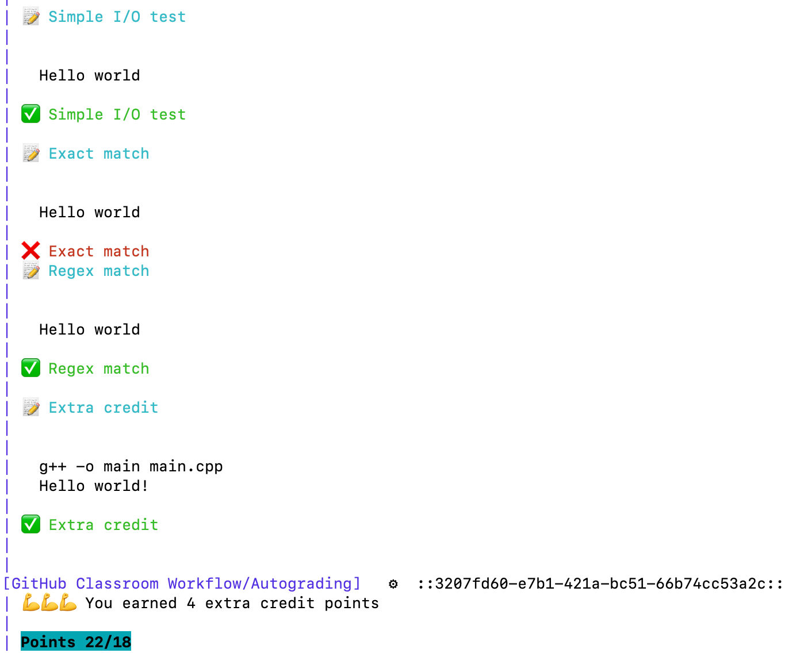

# stevenbitner/autograding


- This repo is forked from https://github.com/education/autograding/.
- The source repository has not been updated in a long time, so I'm hoping to fix a few issues in this repo.

## Basic Usage
The autograder is a GitHub Action that must be triggered as part of a CI workflow.
Each time code is pushed to GitHub with the necessary .github directory elements present, a build will begin that will involve running the tests.
An example [.github](resources/.github) directory is included in the [resources](resources) directory of this repo.

### Either/or
If you set up tests in [GithHub Classroom](https://classroom.github.com) when creating the assignment, it will overwrite the configuration files described below.
As such, if you are going through any part of the process from this action repository, **don not** add tests in the web interface when creating the assignment.

### TLDR
- Copy the .github directory (contained in [resources](resources)) to the top level of the repository to be graded.
- Update the test descriptions in [.github/classroom/autograding.json](resources/.github/classroom/autograding.json) to align with what you want to assess.


### Files needed
- This runner will compare results of commands against expected output, or simply utilize the output code of a program.
- The tests to run must be defined in a JSON file, located at .github/classroom/autograding.json within the repository to grade.
- The attributes for the test objects are:
	- name: A simple string indicating what should be output to the terminal when the test is being run.
	- setup: Any commands required _before_ the test starts running. An example might be "rm *.o" if .o files should be cleaned up before running.
	- run: This is the command to run. Plumbing together multiple commands is valid.
	- input: The input that the runner will send to the run command via standard in.
	- output: The output (or substring of output) that is expected as a result of the run command.
	- comparison: one of 'exact', 'included', or 'regex'.
		- 'exact' is used when the output from the run command should match the string in the `output` attribute exactly. E.g. program output of "Hello world" would **fail** if the `output` attribute were set to "Hello". 
		- 'included' means that the value of the `output` attribute must be a substring of the program output. E.g. program output of "Hello world!" would **pass** if the `output` attribute were "Hello".
		- 'regex' allows a regex string to be used to validate the output.
	- timeout: Sets a timeout on how long the program can run and still be considered a "passing" test. Time is in minutes.
		- ***Note:*** the `timeout` attribute of the test will not halt execution. Prefixing `run` commands with `timeout XX` will halt execution after XX seconds.
		- Failing to include the Linux `timeout` command in your `run` attribute may result in infinite loops or other code issues consuming a large portion of GitHub Actions minutes for your organization.
	- points: This is the integer number of points that the test is worth. It is all or nothing, no partial points are possible within a given test. If partial credit is needed, you must split up the test.
	- extra: This attribute should be present (and set to `true`) only if the test is considered extra credit and should not count toward the total points possible.
- The output from the test suite that would be run by [resources/.github](resources/.github) will look like this:\


### Extras
#### Current Score Badge on README
To add a current score badge to the repository homepage, add the following line near the top of the project README.md.
This will display the point total for the most recent push and when clicked will link to the Actions page for the repository.
The badge is created by workflow actions in the example [.github/workflows/classroom.yml](resources/.github/workflows/classroom.yml).
Changes to that file may break this setup.
```md
[](../../actions)
```

#### Running locally with Docker
- Get the Docker image here https://hub.docker.com/repository/docker/sbitner/github-action-runner. 
	- Follow the directions in that README

## Contributing
### Unit Tests
- Unit test suites are in [src/__tests__](src/__tests__).
	- Adding functionality? Add a test.
	- Running the tests is easy, simply run `npm test` at the top level of the repository.

### Formatting
- The CI build will fail if your code does not conform to the linting standards outlined in [.eslintrc.json](.eslintrc.json).
- Two spaces per indentation level.
